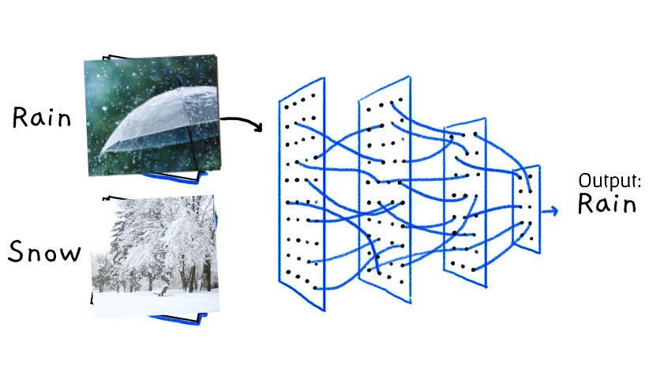

## Deep Learning Image Classification Project

This project is a deep learning image classification pipeline that leverages the power of PyTorch and popular deep learning models to classify images into various classes. It includes several Python modules that work together to create, train, and evaluate a deep neural network.

## Project Highlights
- This project is tailored to address image classification tasks, offering a comprehensive solution for training and deploying deep learning models proficiently.
- It includes a custom implementation of the EfficientNetB2 architecture for image classification, which can be easily adapted for different datasets.
- The project provides a complete training pipeline with functions for training, testing, and visualization of results.

### **The project's model has been trained to recognize multiple weather conditions including:**
- Cloudy
- Rainy
- Snowy
- Foggy
- Dew
- Fogsmog
- Frost
- Hail
- Lightning
- Rainbow
- Shine
- Sunrise

## Technologies Used
- **Python**: The core programming language used for implementing the project's modules and scripts.
- **PyTorch**: A powerful deep learning framework used for building and training neural networks.
- **EfficientNetB2**: A state-of-the-art deep learning architecture employed for image classification tasks.
- - **Matplotlib**: A versatile library for creating visualizations, including plotting loss and accuracy curves during training.

## Accuracy

**This deep learning image classification project provides a solid foundation for building and training deep neural networks for image classification tasks. Feel free to use and modify it for your specific image classification projects.**
### [[DEMO]](https://huggingface.co/spaces/georgescutelnicu/weather-image-classifier)
